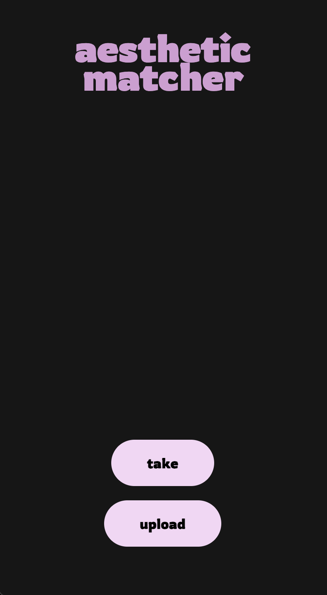
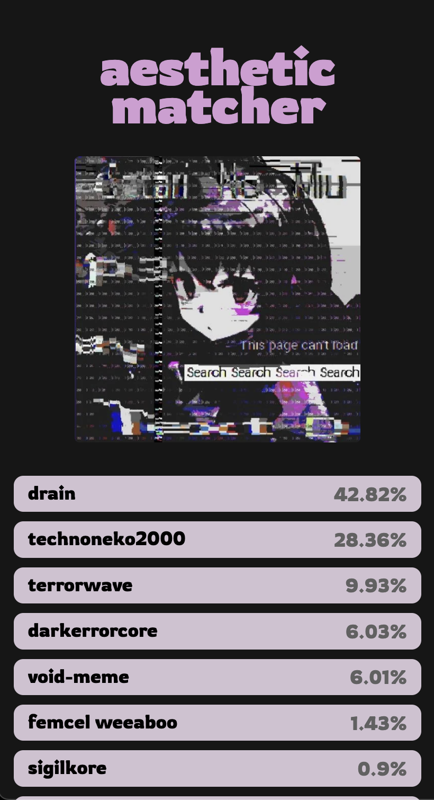
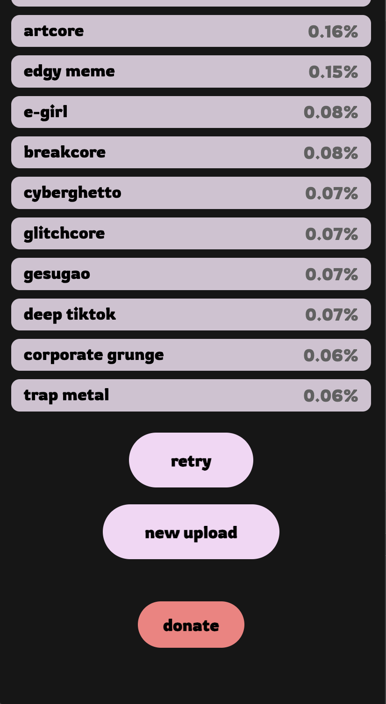

# aesthetic matcher
A web app that classifies uploaded photos into aesthetics using a fine-tuned CLIP model and a custom dataset scraped from the aesthetics wiki.

<p align="center">
  
  
  
</p>

## Features

- Upload images to be classified into various aesthetics.
- Fine-tuned CLIP model for enhanced classification accuracy.
- Web scraper for aesthetic descriptions and origins from Aesthetics Wiki.
- Built with React Native Expo front end and Flask backend

## Project Structure
```
aesthetic-matcher
├── client/                  # React Native frontend code
├── datarefinement/           # Scripts for data refinement and preprocessing
├── finetuning/               # Model fine-tuning scripts (PyTorch, Hugging Face)
└── server/                   # Flask server backend for handling image processing
```
