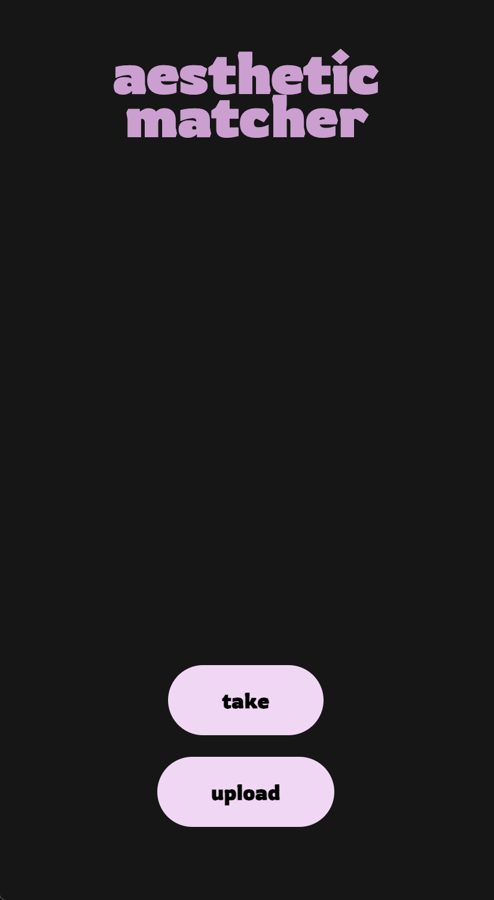
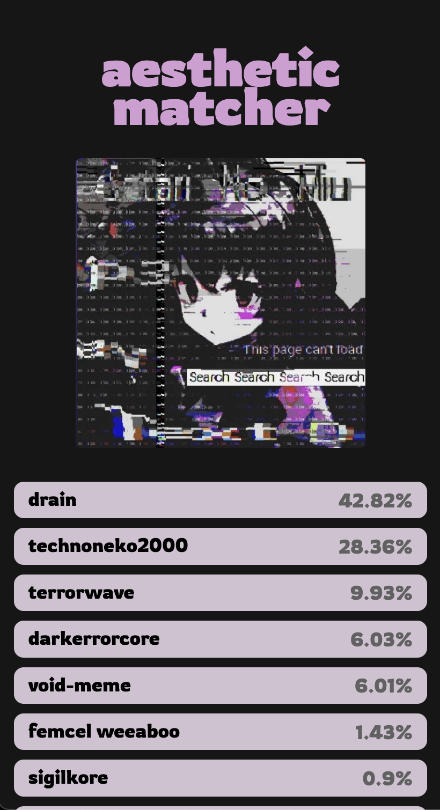
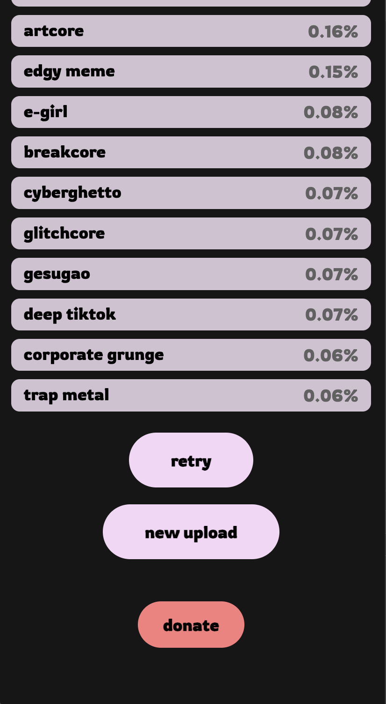

# Aesthetic Matcher

Aesthetic Matcher classifies uploaded images into visual aesthetics using a
custom image-analysis service and research derived from Aesthetics Wiki data.

The current public application is available at
[aestheticmatcher.com](https://aestheticmatcher.com).

<p align="center">
  
  
  
</p>

## Repository layout

```text
aesthetic-matcher/
├── frontend/                  # Current public Astro application
├── backend/
│   └── image-analysis/        # Canonical shared GPU backend
├── legacy/
│   ├── expo-client/           # Previous Expo and React Native client
│   └── flask-backend/         # Original backend prototype
├── research/
│   ├── data-refinement/       # Scraping and preprocessing tools
│   └── fine-tuning/           # Model experiments and notebooks
├── docs/
│   ├── ARCHITECTURE.md
│   └── images/
└── .github/workflows/         # Build and deployment pipeline
```

The production image-analysis API is owned by this repository under
`backend/image-analysis`. Pic-to-Playlist receives a synchronized copy for
local development, while Aesthetic Matcher remains the only deployment owner.
The Flask code in `legacy/flask-backend` is retained as historical source and
is not the production backend.

## Develop the web application

```bash
cd frontend
npm ci
npm run dev
```

## Build

```bash
cd frontend
npm ci
npm run build
```

Static output is written to `frontend/dist`.

## Deployment

`.github/workflows/deploy.yml` builds the Astro site and deploys the generated
files to `/srv/kevin/web/aestheticmatcher.com` on the Linux server. Production
credentials are supplied through the GitHub `production` environment and are
never stored in this repository.

## Research data

Research scripts and notebooks are versioned. Downloaded images, generated
datasets, model output, dependencies, and local environments are not committed.
Server-side research data belongs under
`/srv/kevin/data/aesthetic-matcher/research` when Linux processing is needed.
